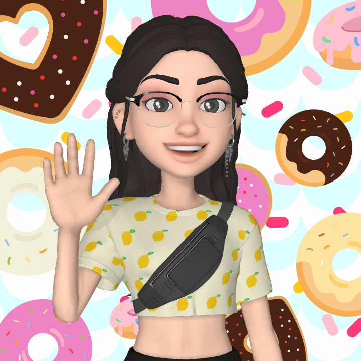

## ✨ Hello and Welcome, I'm Lucy!

👩🏻‍💻 I'm a second year computer science student minoring in 🧬 biochemistry @[ubc](https://ubc.ca). My interests lie in the intersection of chemistry/biology, health care and computer science. In my free time I like (more like used to) to 🏋️‍♀️ powerlift and 🎶 listen to kpop. 

Check out my [site](http://lhao03.github.io/) to learn more about me or send me an [email](mailto:hao.lucyy@gmail.com)

You can also check out my [blog](https://lhao03.github.io/blog/).

	
	

